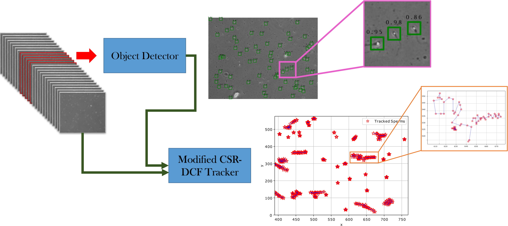

# Sperm detection and tracking in phase-contrast microscopy image sequences using deep learning and modified CSR-DCF

This folder contains tracking algorithms and the code used in this paper : https://arxiv.org/abs/2002.04034

The code used for improving motile objects detection accuracy on RetinaNet is available on https://github.com/mr7495/RetinaNet_Motile_objects_Detection.


Nowadays, computer-aided sperm analysis (CASA) systems have made a big leap in extracting
the characteristics of spermatozoa for studies or measuring human fertility. The first step in sperm
characteristics analysis is sperm detection in the frames of the video sample. In this article, we used
RetinaNet, a deep fully convolutional neural network, as the object detector. Sperms are small objects
with few attributes, that makes the detection more difficult in high-density samples and especially
when there are other particles in semen, which could be like sperm heads. One of the main attributes
of sperms is their movement, but this attribute cannot be extracted when only one frame would be
fed to the network. To improve the performance of the sperm detection network, we concatenated
some consecutive frames to use as the input of the network. With this method, the motility attribute
has also been extracted, and then with the help of the deep convolutional network, we have achieved
high accuracy in sperm detection. The second step is tracking the sperms, for extracting the motility
parameters that are essential for indicating fertility and other studies on sperms. In the tracking
phase, we modify the CSR-DCF algorithm. This method also has shown excellent results in sperm
tracking even in high-density sperm samples, occlusions, sperm colliding, and when sperms exit from
a frame and re-enter in the next frames. The average precision of the detection phase is 99.1%, and
the F1 score of the tracking method evaluation is 96.61%. These results can be a great help in studies
investigating sperm behavior and analyzing fertility possibility.


The modified CSR-DCF is a multi target tracker that uses CSR-DCF tracker as its core and works with both of tracking algorithms and the detected objects of the video frames.

The graphical abstract of our paper is presented in the next figure:

<p align="center">
	
	<br>
	<em>Graphical Abstract</em>
</p>

We have tested our tracker on the 9 video samples of sperms with the detections and achieved 96.61% F1 score and also we have tested it on 36 videos with the ground truth instead of the detections and the results have shown 100% accuracy with no false track based on our evaluation method.
This is a result of excellent performance of this tracker.

**The main code is in the modified csr-dcf.py file.**

**The code for extracting motility parameters is available on Github_motility_parameters_extractor.py.**

A sample of our Ground-truth data is also shared in annotation sample.csv.

The next figures show some of the tracked sperms:


**Our trained neural network based on 3 concatenated frames have been shared on:** 

https://drive.google.com/open?id=1pN3A-tWJOphRdTZ7cPhJTnTIhoiGrcWv

If you find our work effective, you can cite our paper by:

```
@article{rahimzadeh2020sperm,
  title={Sperm detection and tracking in phase-contrast microscopy image sequences using deep learning and modified CSR-DCF},
  author={Rahimzadeh, Mohammad and Attar, Abolfazl and others},
  journal={arXiv preprint arXiv:2002.04034},
  year={2020}
}
```
You can contact the developer by this email : mr7495@yahoo.com
